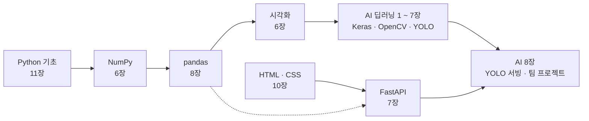

# 🤖 AI 서비스 개발 입문 — Python 부터 YOLO 객체 탐지 웹 서비스까지

파이썬 → 넘파이 → 판다스 → 시각화 → AI 딥러닝(Keras · OpenCV · YOLO) → HTML/CSS → FastAPI 모델 서빙까지 — **완전 초보자**를 위한 장별 예제와 Word 교안입니다.

| 과정 | 장 수 | 내용 |
|---|:---:|---|
| [Python 기초](python/README.md) | 11 | 프로그래밍을 처음 배우는 사람을 위한 파이썬 기초. 출력과 변수부터 함수, 클래스, 파일·모듈, 클래스 타입 체크까지. |
| [NumPy 기초](numpy/README.md) | 6 | 숫자 데이터를 빠르게 계산하는 배열 라이브러리. 배열 만들기부터 인덱싱, 브로드캐스팅, 통계, 난수까지. |
| [pandas 기초](pandas/README.md) | 8 | 표(행과 열) 데이터를 분석하는 라이브러리. Series, DataFrame부터 필터, 그룹 집계, 합치기, 외부 CSV 파일(한글 엑셀·여러 파일·큰 파일·URL) 처리까지. |
| [데이터 시각화 (matplotlib · seaborn)](visualization/README.md) | 6 | 데이터를 그래프로. matplotlib 기초와 꾸미기, pandas 연동, seaborn 통계 그래프, 탐색적 데이터 분석(EDA) 보고서까지. 모든 교안에 실행 결과 그래프 이미지 포함. |
| [AI 딥러닝 (Keras · OpenCV · YOLO)](ai_deep_learning/README.md) | 8 | AI 개념부터 객체 탐지 프로젝트까지. 머신러닝 기초(scikit-learn), Keras 딥러닝 · CNN · 전이 학습, OpenCV 영상 처리, 객체 탐지 개념(IoU · NMS · mAP), 윈도우 labelImg 레이블링과 YOLO 데이터셋, YOLO 학습 · 추론, FastAPI + HTML/CSS 서빙과 팀 프로젝트 가이드까지. |
| [HTML · CSS (시맨틱 화면 구도)](html_css/README.md) | 10 | AI 서비스 화면을 직접 만들기. HTML 기초 · 폼, ⭐ 시맨틱 태그로 화면 구도 잡기(4개 장: 이해 · 기본 패턴 · 실전 페이지 5종 · Grid areas), CSS 박스 모델 · Flexbox · Grid · 반응형, FastAPI 서버와 연결까지. 모든 예제 W3C 검사 통과, 브라우저 렌더링 화면 포함. |
| [FastAPI 모델 서빙](fastapi/README.md) | 7 | 학습한 모델을 웹 API로 서비스하기. API 기초, Pydantic 검사, CRUD, 의존성·lifespan, 이미지 업로드·전처리, 모델 서빙(/predict), pytest 테스트와 Docker 배포까지. |

## 📥 교안 한 번에 받기

- [교안_전체.zip](교안_전체.zip) — 56개 Word 교안 전체 (파일 화면에서 오른쪽 위 다운로드 ⬇ 버튼)

## 🗺 학습 순서



> AI 과정(1 ~ 7장)과 웹 과정(HTML · CSS → FastAPI)은 나란히 공부할 수 있어요. 두 길은 **AI 8장**에서 만나요: 7장에서 학습한 YOLO 모델을 HTML/CSS 10장의 웹 화면 · FastAPI 서버에 연결해 팀 프로젝트(예: 부유물 탐지, 주제는 팀이 선택)를 완성해요. 레이블링은 윈도우용 **labelImg** 로 해요(AI 6장).

### Python 기초

| 장 | 주제 | 교안 |
|:---:|---|---|
| 01 | [파이썬 시작하기 — 출력 · 변수 · 입력](python/01_%EC%8B%9C%EC%9E%91%ED%95%98%EA%B8%B0/) | [📘](python/01_%EC%8B%9C%EC%9E%91%ED%95%98%EA%B8%B0/01_%ED%8C%8C%EC%9D%B4%EC%8D%AC_%EC%8B%9C%EC%9E%91%ED%95%98%EA%B8%B0_%EA%B5%90%EC%95%88.docx) |
| 02 | [자료형과 연산자](python/02_%EC%9E%90%EB%A3%8C%ED%98%95%EA%B3%BC_%EC%97%B0%EC%82%B0%EC%9E%90/) | [📘](python/02_%EC%9E%90%EB%A3%8C%ED%98%95%EA%B3%BC_%EC%97%B0%EC%82%B0%EC%9E%90/02_%EC%9E%90%EB%A3%8C%ED%98%95%EA%B3%BC_%EC%97%B0%EC%82%B0%EC%9E%90_%EA%B5%90%EC%95%88.docx) |
| 03 | [문자열 다루기](python/03_%EB%AC%B8%EC%9E%90%EC%97%B4/) | [📘](python/03_%EB%AC%B8%EC%9E%90%EC%97%B4/03_%EB%AC%B8%EC%9E%90%EC%97%B4_%EA%B5%90%EC%95%88.docx) |
| 04 | [조건문 — if · elif · else](python/04_%EC%A1%B0%EA%B1%B4%EB%AC%B8/) | [📘](python/04_%EC%A1%B0%EA%B1%B4%EB%AC%B8/04_%EC%A1%B0%EA%B1%B4%EB%AC%B8_%EA%B5%90%EC%95%88.docx) |
| 05 | [반복문 — for · while](python/05_%EB%B0%98%EB%B3%B5%EB%AC%B8/) | [📘](python/05_%EB%B0%98%EB%B3%B5%EB%AC%B8/05_%EB%B0%98%EB%B3%B5%EB%AC%B8_%EA%B5%90%EC%95%88.docx) |
| 06 | [리스트와 튜플](python/06_%EB%A6%AC%EC%8A%A4%ED%8A%B8%EC%99%80_%ED%8A%9C%ED%94%8C/) | [📘](python/06_%EB%A6%AC%EC%8A%A4%ED%8A%B8%EC%99%80_%ED%8A%9C%ED%94%8C/06_%EB%A6%AC%EC%8A%A4%ED%8A%B8%EC%99%80_%ED%8A%9C%ED%94%8C_%EA%B5%90%EC%95%88.docx) |
| 07 | [딕셔너리와 집합](python/07_%EB%94%95%EC%85%94%EB%84%88%EB%A6%AC%EC%99%80_%EC%A7%91%ED%95%A9/) | [📘](python/07_%EB%94%95%EC%85%94%EB%84%88%EB%A6%AC%EC%99%80_%EC%A7%91%ED%95%A9/07_%EB%94%95%EC%85%94%EB%84%88%EB%A6%AC%EC%99%80_%EC%A7%91%ED%95%A9_%EA%B5%90%EC%95%88.docx) |
| 08 | [함수](python/08_%ED%95%A8%EC%88%98/) | [📘](python/08_%ED%95%A8%EC%88%98/08_%ED%95%A8%EC%88%98_%EA%B5%90%EC%95%88.docx) |
| 09 | [클래스와 객체](python/09_%ED%81%B4%EB%9E%98%EC%8A%A4%EC%99%80_%EA%B0%9D%EC%B2%B4/) | [📘](python/09_%ED%81%B4%EB%9E%98%EC%8A%A4%EC%99%80_%EA%B0%9D%EC%B2%B4/09_%ED%81%B4%EB%9E%98%EC%8A%A4%EC%99%80_%EA%B0%9D%EC%B2%B4_%EA%B5%90%EC%95%88.docx) |
| 10 | [예외처리 · 파일 · 모듈](python/10_%EC%98%88%EC%99%B8%EC%B2%98%EB%A6%AC_%ED%8C%8C%EC%9D%BC_%EB%AA%A8%EB%93%88/) | [📘](python/10_%EC%98%88%EC%99%B8%EC%B2%98%EB%A6%AC_%ED%8C%8C%EC%9D%BC_%EB%AA%A8%EB%93%88/10_%EC%98%88%EC%99%B8%EC%B2%98%EB%A6%AC_%ED%8C%8C%EC%9D%BC_%EB%AA%A8%EB%93%88_%EA%B5%90%EC%95%88.docx) |
| 11 | [클래스와 타입 체크](python/11_%ED%81%B4%EB%9E%98%EC%8A%A4%EC%99%80_%ED%83%80%EC%9E%85%EC%B2%B4%ED%81%AC/) | [📘](python/11_%ED%81%B4%EB%9E%98%EC%8A%A4%EC%99%80_%ED%83%80%EC%9E%85%EC%B2%B4%ED%81%AC/11_%ED%81%B4%EB%9E%98%EC%8A%A4%EC%99%80_%ED%83%80%EC%9E%85%EC%B2%B4%ED%81%AC_%EA%B5%90%EC%95%88.docx) |

### NumPy 기초

| 장 | 주제 | 교안 |
|:---:|---|---|
| 01 | [NumPy 시작과 배열 만들기](numpy/01_%EB%84%98%ED%8C%8C%EC%9D%B4_%EC%8B%9C%EC%9E%91%EA%B3%BC_%EB%B0%B0%EC%97%B4%EB%A7%8C%EB%93%A4%EA%B8%B0/) | [📘](numpy/01_%EB%84%98%ED%8C%8C%EC%9D%B4_%EC%8B%9C%EC%9E%91%EA%B3%BC_%EB%B0%B0%EC%97%B4%EB%A7%8C%EB%93%A4%EA%B8%B0/01_%EB%84%98%ED%8C%8C%EC%9D%B4_%EC%8B%9C%EC%9E%91%EA%B3%BC_%EB%B0%B0%EC%97%B4%EB%A7%8C%EB%93%A4%EA%B8%B0_%EA%B5%90%EC%95%88.docx) |
| 02 | [인덱싱과 슬라이싱](numpy/02_%EC%9D%B8%EB%8D%B1%EC%8B%B1%EA%B3%BC_%EC%8A%AC%EB%9D%BC%EC%9D%B4%EC%8B%B1/) | [📘](numpy/02_%EC%9D%B8%EB%8D%B1%EC%8B%B1%EA%B3%BC_%EC%8A%AC%EB%9D%BC%EC%9D%B4%EC%8B%B1/02_%EC%9D%B8%EB%8D%B1%EC%8B%B1%EA%B3%BC_%EC%8A%AC%EB%9D%BC%EC%9D%B4%EC%8B%B1_%EA%B5%90%EC%95%88.docx) |
| 03 | [배열 연산과 브로드캐스팅](numpy/03_%EB%B0%B0%EC%97%B4%EC%97%B0%EC%82%B0%EA%B3%BC_%EB%B8%8C%EB%A1%9C%EB%93%9C%EC%BA%90%EC%8A%A4%ED%8C%85/) | [📘](numpy/03_%EB%B0%B0%EC%97%B4%EC%97%B0%EC%82%B0%EA%B3%BC_%EB%B8%8C%EB%A1%9C%EB%93%9C%EC%BA%90%EC%8A%A4%ED%8C%85/03_%EB%B0%B0%EC%97%B4%EC%97%B0%EC%82%B0%EA%B3%BC_%EB%B8%8C%EB%A1%9C%EB%93%9C%EC%BA%90%EC%8A%A4%ED%8C%85_%EA%B5%90%EC%95%88.docx) |
| 04 | [배열 형태 바꾸기 · 합치기 · 나누기](numpy/04_%EB%B0%B0%EC%97%B4_%ED%98%95%ED%83%9C_%EB%B0%94%EA%BE%B8%EA%B8%B0/) | [📘](numpy/04_%EB%B0%B0%EC%97%B4_%ED%98%95%ED%83%9C_%EB%B0%94%EA%BE%B8%EA%B8%B0/04_%EB%B0%B0%EC%97%B4_%ED%98%95%ED%83%9C_%EB%B0%94%EA%BE%B8%EA%B8%B0_%EA%B5%90%EC%95%88.docx) |
| 05 | [통계와 집계](numpy/05_%ED%86%B5%EA%B3%84%EC%99%80_%EC%A7%91%EA%B3%84/) | [📘](numpy/05_%ED%86%B5%EA%B3%84%EC%99%80_%EC%A7%91%EA%B3%84/05_%ED%86%B5%EA%B3%84%EC%99%80_%EC%A7%91%EA%B3%84_%EA%B5%90%EC%95%88.docx) |
| 06 | [난수와 실전 예제](numpy/06_%EB%82%9C%EC%88%98%EC%99%80_%EC%8B%A4%EC%A0%84%EC%98%88%EC%A0%9C/) | [📘](numpy/06_%EB%82%9C%EC%88%98%EC%99%80_%EC%8B%A4%EC%A0%84%EC%98%88%EC%A0%9C/06_%EB%82%9C%EC%88%98%EC%99%80_%EC%8B%A4%EC%A0%84%EC%98%88%EC%A0%9C_%EA%B5%90%EC%95%88.docx) |

### pandas 기초

| 장 | 주제 | 교안 |
|:---:|---|---|
| 01 | [pandas 시작과 Series](pandas/01_%EC%8B%9C%EB%A6%AC%EC%A6%88/) | [📘](pandas/01_%EC%8B%9C%EB%A6%AC%EC%A6%88/01_%EC%8B%9C%EB%A6%AC%EC%A6%88_Series_%EA%B5%90%EC%95%88.docx) |
| 02 | [DataFrame 만들기와 살펴보기](pandas/02_%EB%8D%B0%EC%9D%B4%ED%84%B0%ED%94%84%EB%A0%88%EC%9E%84_%EB%A7%8C%EB%93%A4%EA%B8%B0/) | [📘](pandas/02_%EB%8D%B0%EC%9D%B4%ED%84%B0%ED%94%84%EB%A0%88%EC%9E%84_%EB%A7%8C%EB%93%A4%EA%B8%B0/02_%EB%8D%B0%EC%9D%B4%ED%84%B0%ED%94%84%EB%A0%88%EC%9E%84_%EB%A7%8C%EB%93%A4%EA%B8%B0%EC%99%80_%EC%82%B4%ED%8E%B4%EB%B3%B4%EA%B8%B0_%EA%B5%90%EC%95%88.docx) |
| 03 | [데이터 선택과 필터](pandas/03_%EB%8D%B0%EC%9D%B4%ED%84%B0_%EC%84%A0%ED%83%9D%EA%B3%BC_%ED%95%84%ED%84%B0/) | [📘](pandas/03_%EB%8D%B0%EC%9D%B4%ED%84%B0_%EC%84%A0%ED%83%9D%EA%B3%BC_%ED%95%84%ED%84%B0/03_%EB%8D%B0%EC%9D%B4%ED%84%B0_%EC%84%A0%ED%83%9D%EA%B3%BC_%ED%95%84%ED%84%B0_%EA%B5%90%EC%95%88.docx) |
| 04 | [데이터 수정 · 정렬 · 결측치](pandas/04_%EB%8D%B0%EC%9D%B4%ED%84%B0_%EC%88%98%EC%A0%95%EA%B3%BC_%EA%B2%B0%EC%B8%A1%EC%B9%98/) | [📘](pandas/04_%EB%8D%B0%EC%9D%B4%ED%84%B0_%EC%88%98%EC%A0%95%EA%B3%BC_%EA%B2%B0%EC%B8%A1%EC%B9%98/04_%EB%8D%B0%EC%9D%B4%ED%84%B0_%EC%88%98%EC%A0%95%EA%B3%BC_%EA%B2%B0%EC%B8%A1%EC%B9%98_%EA%B5%90%EC%95%88.docx) |
| 05 | [그룹과 집계](pandas/05_%EA%B7%B8%EB%A3%B9%EA%B3%BC_%EC%A7%91%EA%B3%84/) | [📘](pandas/05_%EA%B7%B8%EB%A3%B9%EA%B3%BC_%EC%A7%91%EA%B3%84/05_%EA%B7%B8%EB%A3%B9%EA%B3%BC_%EC%A7%91%EA%B3%84_%EA%B5%90%EC%95%88.docx) |
| 06 | [데이터 합치기 — concat · merge](pandas/06_%EB%8D%B0%EC%9D%B4%ED%84%B0_%ED%95%A9%EC%B9%98%EA%B8%B0/) | [📘](pandas/06_%EB%8D%B0%EC%9D%B4%ED%84%B0_%ED%95%A9%EC%B9%98%EA%B8%B0/06_%EB%8D%B0%EC%9D%B4%ED%84%B0_%ED%95%A9%EC%B9%98%EA%B8%B0_%EA%B5%90%EC%95%88.docx) |
| 07 | [파일 입출력과 실전 분석](pandas/07_%ED%8C%8C%EC%9D%BC%EC%9E%85%EC%B6%9C%EB%A0%A5%EA%B3%BC_%EC%8B%A4%EC%A0%84%EB%B6%84%EC%84%9D/) | [📘](pandas/07_%ED%8C%8C%EC%9D%BC%EC%9E%85%EC%B6%9C%EB%A0%A5%EA%B3%BC_%EC%8B%A4%EC%A0%84%EB%B6%84%EC%84%9D/07_%ED%8C%8C%EC%9D%BC%EC%9E%85%EC%B6%9C%EB%A0%A5%EA%B3%BC_%EC%8B%A4%EC%A0%84%EB%B6%84%EC%84%9D_%EA%B5%90%EC%95%88.docx) |
| 08 | [외부 CSV 파일 불러와 처리하기](pandas/08_%EC%99%B8%EB%B6%80CSV_%EB%B6%88%EB%9F%AC%EC%99%80_%EC%B2%98%EB%A6%AC%ED%95%98%EA%B8%B0/) | [📘](pandas/08_%EC%99%B8%EB%B6%80CSV_%EB%B6%88%EB%9F%AC%EC%99%80_%EC%B2%98%EB%A6%AC%ED%95%98%EA%B8%B0/08_%EC%99%B8%EB%B6%80CSV_%EB%B6%88%EB%9F%AC%EC%99%80_%EC%B2%98%EB%A6%AC%ED%95%98%EA%B8%B0_%EA%B5%90%EC%95%88.docx) |

### 데이터 시각화 (matplotlib · seaborn)

| 장 | 주제 | 교안 |
|:---:|---|---|
| 01 | [matplotlib 시작하기 — 선 그래프](visualization/01_matplotlib_%EC%8B%9C%EC%9E%91%ED%95%98%EA%B8%B0/) | [📘](visualization/01_matplotlib_%EC%8B%9C%EC%9E%91%ED%95%98%EA%B8%B0/01_matplotlib_%EC%8B%9C%EC%9E%91%ED%95%98%EA%B8%B0_%EA%B5%90%EC%95%88.docx) |
| 02 | [여러 가지 그래프](visualization/02_%EC%97%AC%EB%9F%AC%EA%B0%80%EC%A7%80_%EA%B7%B8%EB%9E%98%ED%94%84/) | [📘](visualization/02_%EC%97%AC%EB%9F%AC%EA%B0%80%EC%A7%80_%EA%B7%B8%EB%9E%98%ED%94%84/02_%EC%97%AC%EB%9F%AC%EA%B0%80%EC%A7%80_%EA%B7%B8%EB%9E%98%ED%94%84_%EA%B5%90%EC%95%88.docx) |
| 03 | [여러 그래프 나눠 그리기와 꾸미기](visualization/03_%EC%97%AC%EB%9F%AC%EA%B7%B8%EB%9E%98%ED%94%84%EC%99%80_%EA%BE%B8%EB%AF%B8%EA%B8%B0/) | [📘](visualization/03_%EC%97%AC%EB%9F%AC%EA%B7%B8%EB%9E%98%ED%94%84%EC%99%80_%EA%BE%B8%EB%AF%B8%EA%B8%B0/03_%EC%97%AC%EB%9F%AC%EA%B7%B8%EB%9E%98%ED%94%84%EC%99%80_%EA%BE%B8%EB%AF%B8%EA%B8%B0_%EA%B5%90%EC%95%88.docx) |
| 04 | [pandas 와 함께 시각화](visualization/04_pandas%EC%99%80_%EC%8B%9C%EA%B0%81%ED%99%94/) | [📘](visualization/04_pandas%EC%99%80_%EC%8B%9C%EA%B0%81%ED%99%94/04_pandas%EC%99%80_%EC%8B%9C%EA%B0%81%ED%99%94_%EA%B5%90%EC%95%88.docx) |
| 05 | [seaborn 기초](visualization/05_seaborn_%EA%B8%B0%EC%B4%88/) | [📘](visualization/05_seaborn_%EA%B8%B0%EC%B4%88/05_seaborn_%EA%B8%B0%EC%B4%88_%EA%B5%90%EC%95%88.docx) |
| 06 | [seaborn 심화와 실전 분석](visualization/06_seaborn_%EC%8B%AC%ED%99%94%EC%99%80_%EC%8B%A4%EC%A0%84/) | [📘](visualization/06_seaborn_%EC%8B%AC%ED%99%94%EC%99%80_%EC%8B%A4%EC%A0%84/06_seaborn_%EC%8B%AC%ED%99%94%EC%99%80_%EC%8B%A4%EC%A0%84_%EA%B5%90%EC%95%88.docx) |

### AI 딥러닝 (Keras · OpenCV · YOLO)

| 장 | 주제 | 교안 |
|:---:|---|---|
| 01 | [AI 기술 개요 — 인공지능 · 머신러닝 · 딥러닝 · 객체 탐지](ai_deep_learning/01_AI%EA%B0%9C%EC%9A%94/) | [📘](ai_deep_learning/01_AI%EA%B0%9C%EC%9A%94/01_AI%EA%B0%9C%EC%9A%94_%EA%B5%90%EC%95%88.docx) |
| 02 | [머신러닝 기초 — 학습 · 평가 · 과대적합](ai_deep_learning/02_%EB%A8%B8%EC%8B%A0%EB%9F%AC%EB%8B%9D%EA%B8%B0%EC%B4%88/) | [📘](ai_deep_learning/02_%EB%A8%B8%EC%8B%A0%EB%9F%AC%EB%8B%9D%EA%B8%B0%EC%B4%88/02_%EB%A8%B8%EC%8B%A0%EB%9F%AC%EB%8B%9D%EA%B8%B0%EC%B4%88_%EA%B5%90%EC%95%88.docx) |
| 03 | [Keras 로 배우는 딥러닝 기초](ai_deep_learning/03_Keras%EB%94%A5%EB%9F%AC%EB%8B%9D%EA%B8%B0%EC%B4%88/) | [📘](ai_deep_learning/03_Keras%EB%94%A5%EB%9F%AC%EB%8B%9D%EA%B8%B0%EC%B4%88/03_Keras%EB%94%A5%EB%9F%AC%EB%8B%9D%EA%B8%B0%EC%B4%88_%EA%B5%90%EC%95%88.docx) |
| 04 | [CNN — 이미지를 보는 신경망](ai_deep_learning/04_CNN%EC%9D%B4%EB%AF%B8%EC%A7%80%EB%B6%84%EB%A5%98/) | [📘](ai_deep_learning/04_CNN%EC%9D%B4%EB%AF%B8%EC%A7%80%EB%B6%84%EB%A5%98/04_CNN%EC%9D%B4%EB%AF%B8%EC%A7%80%EB%B6%84%EB%A5%98_%EA%B5%90%EC%95%88.docx) |
| 05 | [OpenCV 로 영상 다루기](ai_deep_learning/05_OpenCV%EC%98%81%EC%83%81%EC%B2%98%EB%A6%AC/) | [📘](ai_deep_learning/05_OpenCV%EC%98%81%EC%83%81%EC%B2%98%EB%A6%AC/05_OpenCV%EC%98%81%EC%83%81%EC%B2%98%EB%A6%AC_%EA%B5%90%EC%95%88.docx) |
| 06 | [객체 탐지 개념과 레이블링 (labelImg · YOLO 데이터셋)](ai_deep_learning/06_%EA%B0%9D%EC%B2%B4%ED%83%90%EC%A7%80%EC%99%80_%EB%A0%88%EC%9D%B4%EB%B8%94%EB%A7%81/) | [📘](ai_deep_learning/06_%EA%B0%9D%EC%B2%B4%ED%83%90%EC%A7%80%EC%99%80_%EB%A0%88%EC%9D%B4%EB%B8%94%EB%A7%81/06_%EA%B0%9D%EC%B2%B4%ED%83%90%EC%A7%80%EC%99%80_%EB%A0%88%EC%9D%B4%EB%B8%94%EB%A7%81_%EA%B5%90%EC%95%88.docx) |
| 07 | [YOLO 학습과 추론](ai_deep_learning/07_YOLO%ED%95%99%EC%8A%B5%EA%B3%BC%EC%B6%94%EB%A1%A0/) | [📘](ai_deep_learning/07_YOLO%ED%95%99%EC%8A%B5%EA%B3%BC%EC%B6%94%EB%A1%A0/07_YOLO%ED%95%99%EC%8A%B5%EA%B3%BC%EC%B6%94%EB%A1%A0_%EA%B5%90%EC%95%88.docx) |
| 08 | [AI 시스템 구축 — YOLO 서빙과 팀 프로젝트](ai_deep_learning/08_YOLO%EC%84%9C%EB%B9%99%EA%B3%BC_%ED%94%84%EB%A1%9C%EC%A0%9D%ED%8A%B8/) | [📘](ai_deep_learning/08_YOLO%EC%84%9C%EB%B9%99%EA%B3%BC_%ED%94%84%EB%A1%9C%EC%A0%9D%ED%8A%B8/08_YOLO%EC%84%9C%EB%B9%99%EA%B3%BC_%ED%94%84%EB%A1%9C%EC%A0%9D%ED%8A%B8_%EA%B5%90%EC%95%88.docx) |

### HTML · CSS (시맨틱 화면 구도)

| 장 | 주제 | 교안 |
|:---:|---|---|
| 01 | [HTML 시작하기](html_css/01_HTML_%EC%8B%9C%EC%9E%91%ED%95%98%EA%B8%B0/) | [📘](html_css/01_HTML_%EC%8B%9C%EC%9E%91%ED%95%98%EA%B8%B0/01_HTML_%EC%8B%9C%EC%9E%91%ED%95%98%EA%B8%B0_%EA%B5%90%EC%95%88.docx) |
| 02 | [목록 · 표 · 폼](html_css/02_%EB%AA%A9%EB%A1%9D_%ED%91%9C_%ED%8F%BC/) | [📘](html_css/02_%EB%AA%A9%EB%A1%9D_%ED%91%9C_%ED%8F%BC/02_%EB%AA%A9%EB%A1%9D_%ED%91%9C_%ED%8F%BC_%EA%B5%90%EC%95%88.docx) |
| 03 | [시맨틱 태그 이해하기](html_css/03_%EC%8B%9C%EB%A7%A8%ED%8B%B1_%ED%83%9C%EA%B7%B8_%EC%9D%B4%ED%95%B4/) | [📘](html_css/03_%EC%8B%9C%EB%A7%A8%ED%8B%B1_%ED%83%9C%EA%B7%B8_%EC%9D%B4%ED%95%B4/03_%EC%8B%9C%EB%A7%A8%ED%8B%B1_%ED%83%9C%EA%B7%B8_%EC%9D%B4%ED%95%B4_%EA%B5%90%EC%95%88.docx) |
| 04 | [시맨틱 태그로 화면 구도 잡기 ① — 기본 패턴](html_css/04_%EC%8B%9C%EB%A7%A8%ED%8B%B1_%ED%99%94%EB%A9%B4%EA%B5%AC%EB%8F%84_%EA%B8%B0%EB%B3%B8%ED%8C%A8%ED%84%B4/) | [📘](html_css/04_%EC%8B%9C%EB%A7%A8%ED%8B%B1_%ED%99%94%EB%A9%B4%EA%B5%AC%EB%8F%84_%EA%B8%B0%EB%B3%B8%ED%8C%A8%ED%84%B4/04_%EC%8B%9C%EB%A7%A8%ED%8B%B1_%ED%99%94%EB%A9%B4%EA%B5%AC%EB%8F%84_%EA%B8%B0%EB%B3%B8%ED%8C%A8%ED%84%B4_%EA%B5%90%EC%95%88.docx) |
| 05 | [시맨틱 태그로 화면 구도 잡기 ② — 실전 페이지 5종](html_css/05_%EC%8B%9C%EB%A7%A8%ED%8B%B1_%ED%99%94%EB%A9%B4%EA%B5%AC%EB%8F%84_%EC%8B%A4%EC%A0%84%ED%8E%98%EC%9D%B4%EC%A7%80/) | [📘](html_css/05_%EC%8B%9C%EB%A7%A8%ED%8B%B1_%ED%99%94%EB%A9%B4%EA%B5%AC%EB%8F%84_%EC%8B%A4%EC%A0%84%ED%8E%98%EC%9D%B4%EC%A7%80/05_%EC%8B%9C%EB%A7%A8%ED%8B%B1_%ED%99%94%EB%A9%B4%EA%B5%AC%EB%8F%84_%EC%8B%A4%EC%A0%84%ED%8E%98%EC%9D%B4%EC%A7%80_%EA%B5%90%EC%95%88.docx) |
| 06 | [CSS 기초와 박스 모델](html_css/06_CSS%EA%B8%B0%EC%B4%88_%EB%B0%95%EC%8A%A4%EB%AA%A8%EB%8D%B8/) | [📘](html_css/06_CSS%EA%B8%B0%EC%B4%88_%EB%B0%95%EC%8A%A4%EB%AA%A8%EB%8D%B8/06_CSS%EA%B8%B0%EC%B4%88_%EB%B0%95%EC%8A%A4%EB%AA%A8%EB%8D%B8_%EA%B5%90%EC%95%88.docx) |
| 07 | [Flexbox — 한 줄로 늘어놓고 정렬하기](html_css/07_Flexbox/) | [📘](html_css/07_Flexbox/07_Flexbox_%EA%B5%90%EC%95%88.docx) |
| 08 | [CSS Grid — 시맨틱 태그로 화면 구도 완성하기](html_css/08_Grid_%EC%8B%9C%EB%A7%A8%ED%8B%B1%EB%A0%88%EC%9D%B4%EC%95%84%EC%9B%83/) | [📘](html_css/08_Grid_%EC%8B%9C%EB%A7%A8%ED%8B%B1%EB%A0%88%EC%9D%B4%EC%95%84%EC%9B%83/08_Grid_%EC%8B%9C%EB%A7%A8%ED%8B%B1%EB%A0%88%EC%9D%B4%EC%95%84%EC%9B%83_%EA%B5%90%EC%95%88.docx) |
| 09 | [반응형 웹과 종합 프로젝트 페이지](html_css/09_%EB%B0%98%EC%9D%91%ED%98%95_%EC%A2%85%ED%95%A9%ED%94%84%EB%A1%9C%EC%A0%9D%ED%8A%B8/) | [📘](html_css/09_%EB%B0%98%EC%9D%91%ED%98%95_%EC%A2%85%ED%95%A9%ED%94%84%EB%A1%9C%EC%A0%9D%ED%8A%B8/09_%EB%B0%98%EC%9D%91%ED%98%95_%EC%A2%85%ED%95%A9%ED%94%84%EB%A1%9C%EC%A0%9D%ED%8A%B8_%EA%B5%90%EC%95%88.docx) |
| 10 | [HTML · CSS 페이지를 FastAPI 서버와 연결하기](html_css/10_FastAPI%EC%97%B0%EA%B2%B0/) | [📘](html_css/10_FastAPI%EC%97%B0%EA%B2%B0/10_FastAPI%EC%97%B0%EA%B2%B0_%EA%B5%90%EC%95%88.docx) |

### FastAPI 모델 서빙

| 장 | 주제 | 교안 |
|:---:|---|---|
| 01 | [FastAPI 시작하기](fastapi/01_FastAPI_%EC%8B%9C%EC%9E%91%ED%95%98%EA%B8%B0/) | [📘](fastapi/01_FastAPI_%EC%8B%9C%EC%9E%91%ED%95%98%EA%B8%B0/01_FastAPI_%EC%8B%9C%EC%9E%91%ED%95%98%EA%B8%B0_%EA%B5%90%EC%95%88.docx) |
| 02 | [Pydantic 으로 요청과 응답 다루기](fastapi/02_Pydantic_%EC%9A%94%EC%B2%AD%EA%B3%BC_%EC%9D%91%EB%8B%B5/) | [📘](fastapi/02_Pydantic_%EC%9A%94%EC%B2%AD%EA%B3%BC_%EC%9D%91%EB%8B%B5/02_Pydantic_%EC%9A%94%EC%B2%AD%EA%B3%BC_%EC%9D%91%EB%8B%B5_%EA%B5%90%EC%95%88.docx) |
| 03 | [CRUD API 만들기](fastapi/03_CRUD_API_%EB%A7%8C%EB%93%A4%EA%B8%B0/) | [📘](fastapi/03_CRUD_API_%EB%A7%8C%EB%93%A4%EA%B8%B0/03_CRUD_API_%EB%A7%8C%EB%93%A4%EA%B8%B0_%EA%B5%90%EC%95%88.docx) |
| 04 | [의존성 · 비동기 · 수명주기 · 미들웨어](fastapi/04_%EC%9D%98%EC%A1%B4%EC%84%B1_%EB%B9%84%EB%8F%99%EA%B8%B0_%EC%88%98%EB%AA%85%EC%A3%BC%EA%B8%B0/) | [📘](fastapi/04_%EC%9D%98%EC%A1%B4%EC%84%B1_%EB%B9%84%EB%8F%99%EA%B8%B0_%EC%88%98%EB%AA%85%EC%A3%BC%EA%B8%B0/04_%EC%9D%98%EC%A1%B4%EC%84%B1_%EB%B9%84%EB%8F%99%EA%B8%B0_%EC%88%98%EB%AA%85%EC%A3%BC%EA%B8%B0_%EA%B5%90%EC%95%88.docx) |
| 05 | [파일 업로드와 이미지 처리](fastapi/05_%ED%8C%8C%EC%9D%BC%EC%97%85%EB%A1%9C%EB%93%9C%EC%99%80_%EC%9D%B4%EB%AF%B8%EC%A7%80/) | [📘](fastapi/05_%ED%8C%8C%EC%9D%BC%EC%97%85%EB%A1%9C%EB%93%9C%EC%99%80_%EC%9D%B4%EB%AF%B8%EC%A7%80/05_%ED%8C%8C%EC%9D%BC%EC%97%85%EB%A1%9C%EB%93%9C%EC%99%80_%EC%9D%B4%EB%AF%B8%EC%A7%80_%EA%B5%90%EC%95%88.docx) |
| 06 | [머신러닝 모델 서빙](fastapi/06_%EB%A8%B8%EC%8B%A0%EB%9F%AC%EB%8B%9D_%EB%AA%A8%EB%8D%B8_%EC%84%9C%EB%B9%99/) | [📘](fastapi/06_%EB%A8%B8%EC%8B%A0%EB%9F%AC%EB%8B%9D_%EB%AA%A8%EB%8D%B8_%EC%84%9C%EB%B9%99/06_%EB%A8%B8%EC%8B%A0%EB%9F%AC%EB%8B%9D_%EB%AA%A8%EB%8D%B8_%EC%84%9C%EB%B9%99_%EA%B5%90%EC%95%88.docx) |
| 07 | [프로젝트 구조 · 테스트 · 배포](fastapi/07_%ED%85%8C%EC%8A%A4%ED%8A%B8%EC%99%80_%EB%B0%B0%ED%8F%AC/) | [📘](fastapi/07_%ED%85%8C%EC%8A%A4%ED%8A%B8%EC%99%80_%EB%B0%B0%ED%8F%AC/07_%ED%85%8C%EC%8A%A4%ED%8A%B8%EC%99%80_%EB%B0%B0%ED%8F%AC_%EA%B5%90%EC%95%88.docx) |

## 📘 교안 구성

각 장의 Word 교안은 다음 순서로 되어 있어요.

1. **학습 목표**와 개념을 일상에 빗댄 설명
2. **예제 파일**: 폴더의 `.py` 코드를 줄 번호와 함께 싣고, 중요한 줄마다 "줄 · 코드 · 설명" 표로 해설
3. **추가 설명 코드**: 개념을 더 잘 이해하도록 만든 짧은 예제
4. **실행 결과**: 모든 코드를 실제로 실행해서 나온 출력·그래프·API 응답·브라우저 화면 그대로 (실행할 수 없는 GUI · 웹캠 · 웹 서비스 조작 안내는 "미실행 참고"로 표시)
5. **자주 하는 실수**(실제 오류 메시지), 요약표, **연습문제와 정답**

## 🛠 준비

- **Python 3.12.x 또는 3.13.x** (교안 실행 결과는 Python 3.13 기준)
- 교안 기준 버전: numpy 2.5, pandas 3.0, matplotlib 3.11, seaborn 0.13, FastAPI 0.142, Pydantic 2.13, scikit-learn 1.6, TensorFlow 2.21 · Keras 3.15, OpenCV 5.0, PyTorch 2.14 (CPU), Ultralytics 8.4 (다른 버전에서는 출력 모양이 조금 다를 수 있어요)
- AI 과정은 GPU 없이 CPU 노트북에서 모두 실행해 확인했어요 (YOLO 학습은 작은 연습 데이터 · 적은 에폭)
- 레이블링: Windows 용 labelImg (windows_v1.8.1, 설치 없이 실행)
- 편집기: **VS Code** (내 PC) · **Google Colab** (브라우저, 무료 GPU) — 아래 설치 방법 참고

## 🐍 가상 환경 만들고 한 번에 설치하기

과정마다 패키지를 따로 설치하지 않아도 되도록, 저장소 맨 위에 [requirements.txt](requirements.txt) 가 있어요. **가상 환경(venv)** 을 만들어 그 안에 설치하면 다른 프로젝트와 패키지가 섞이지 않아요.

### 1) Python 3.12 또는 3.13 설치 (Windows)

1. [python.org](https://www.python.org/downloads/windows/) 에서 **Python 3.12.x 또는 3.13.x** (Windows installer 64-bit) 를 내려받아요. 교안 실행 결과는 3.13 으로 만들었어요.
2. 설치 첫 화면에서 **"Add python.exe to PATH"** 를 꼭 체크하고 설치해요.
3. 명령 프롬프트(또는 VS Code 터미널)에서 설치된 버전을 확인해요 (`-V:3.13` 또는 `-V:3.12` 가 보이면 OK).

```bash
py --list
```

### 2) 저장소 받기

```bash
git clone https://github.com/sinaboro/ai-service-course.git
cd ai-service-course
```

> 폴더는 `C:\study\ai-service-course` 처럼 **영어 · 숫자만 있는 경로**에 두는 것을 추천해요 (OpenCV 는 한글 경로에서 사진 읽기 · 저장이 실패할 수 있어요. AI 5장 참고).

### 3) 가상 환경 만들기 · 켜기

```bash
py -3.13 -m venv .venv
```

```bash
.venv\Scripts\activate
```

3.12 를 설치했다면 `py -3.12 -m venv .venv` 로 바꿔 쓰세요. 켜지면 명령 줄 앞에 `(.venv)` 가 붙어요. macOS · Linux 에서는 `python3.13 -m venv .venv` → `source .venv/bin/activate` 를 써요.

> PowerShell 에서 "스크립트를 실행할 수 없습니다" 오류가 나면 명령 프롬프트(cmd)를 쓰거나, VS Code 의 인터프리터 선택(아래 4번)으로 가상 환경을 켜세요.

### 4) requirements.txt 로 한 번에 설치

```bash
python -m pip install --upgrade pip
```

```bash
pip install -r requirements.txt
```

TensorFlow · PyTorch(YOLO) 가 함께 설치되어 **수 GB, 10분 이상** 걸릴 수 있어요. 설치가 끝나면 확인해 보세요.

```bash
python ai_deep_learning/01_AI개요/ex00_check_env.py
```

가상 환경을 끌 때는 `deactivate`, 다음에 다시 공부할 때는 저장소 폴더에서 `.venv\Scripts\activate` 만 하면 돼요.

### 5) VS Code 에서 쓰기

1. [VS Code](https://code.visualstudio.com/) 를 설치하고, 확장(Extensions)에서 **Python**(Microsoft) 과 **Jupyter** 를 설치해요.
2. **파일 → 폴더 열기** 로 `pyhton_numpy_pandas` 폴더를 열어요.
3. `Ctrl + Shift + P` → **Python: Select Interpreter** → `.venv` 가 들어간 항목을 골라요.
4. **터미널 → 새 터미널** 을 열면 `(.venv)` 가 자동으로 켜져요. 예제 폴더로 `cd` 한 뒤 `python ex01_....py` 로 실행하거나, 편집기 오른쪽 위 ▶ 버튼을 눌러요.
5. HTML/CSS 예제는 확장 **Live Server** 를 설치하면 `.html` 파일에서 오른쪽 클릭 → **Open with Live Server** 로 저장할 때마다 자동 새로고침돼요.

### 6) Google Colab 에서 쓰기

Colab 은 설치 없이 브라우저에서 쓰고, **무료 GPU** 로 YOLO 를 빠르게 학습할 수 있어요 (AI 7장 10절). Colab 에는 numpy · pandas · matplotlib · scikit-learn · tensorflow · opencv 가 이미 들어 있어서 보통 아래만 설치하면 돼요.

```python
!git clone https://github.com/sinaboro/pyhton_numpy_pandas.git
%cd pyhton_numpy_pandas
!pip install -q ultralytics fastapi uvicorn python-multipart httpx2 mypy
```

GPU 는 메뉴 **런타임 → 런타임 유형 변경 → T4 GPU** 로 켜요. 예제 파일은 `%cd ai_deep_learning/07_YOLO학습과추론` 처럼 폴더로 이동한 뒤 `!python ex02_train.py` 로 실행해요.

> Colab 에서는 창이 뜨는 코드(`cv2.imshow`), 웹캠, `uvicorn` 서버 화면 보기가 PC 와 다르게 동작해요. 이런 예제(OpenCV 창, 웹캠, FastAPI · HTML 서빙)는 **VS Code(내 PC)** 에서 하고, 오래 걸리는 **학습만 Colab** 에서 하는 것을 추천해요. Colab 런타임이 끝나면 파일이 사라지니 `best.pt` 같은 결과는 내려받거나 Google Drive 에 저장하세요.
