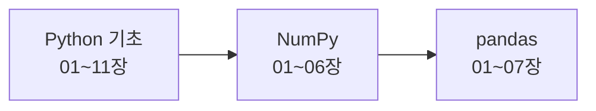

# pyhton_numpy_pandas

파이썬, 넘파이, 판다스 기초 — **완전 초보자**를 위한 장별 예제와 Word 교안입니다.

| 과정 | 장 수 | 내용 |
|---|:---:|---|
| [Python 기초](python/README.md) | 11 | 프로그래밍을 처음 배우는 사람을 위한 파이썬 기초. 출력과 변수부터 함수, 클래스, 파일·모듈, 클래스 타입 체크까지. |
| [NumPy 기초](numpy/README.md) | 6 | 숫자 데이터를 빠르게 계산하는 배열 라이브러리. 배열 만들기부터 인덱싱, 브로드캐스팅, 통계, 난수까지. |
| [pandas 기초](pandas/README.md) | 7 | 표(행과 열) 데이터를 분석하는 라이브러리. Series, DataFrame부터 필터, 그룹 집계, 합치기, CSV 분석까지. |

## 📥 교안 한 번에 받기

- [교안_전체.zip](교안_전체.zip) — 24개 Word 교안 전체 (파일 화면에서 오른쪽 위 다운로드 ⬇ 버튼)

## 🗺 학습 순서



### Python 기초

| 장 | 주제 | 교안 |
|:---:|---|---|
| 01 | [파이썬 시작하기 — 출력 · 변수 · 입력](python/01_%EC%8B%9C%EC%9E%91%ED%95%98%EA%B8%B0/) | [📘](python/01_%EC%8B%9C%EC%9E%91%ED%95%98%EA%B8%B0/01_%ED%8C%8C%EC%9D%B4%EC%8D%AC_%EC%8B%9C%EC%9E%91%ED%95%98%EA%B8%B0_%EA%B5%90%EC%95%88.docx) |
| 02 | [자료형과 연산자](python/02_%EC%9E%90%EB%A3%8C%ED%98%95%EA%B3%BC_%EC%97%B0%EC%82%B0%EC%9E%90/) | [📘](python/02_%EC%9E%90%EB%A3%8C%ED%98%95%EA%B3%BC_%EC%97%B0%EC%82%B0%EC%9E%90/02_%EC%9E%90%EB%A3%8C%ED%98%95%EA%B3%BC_%EC%97%B0%EC%82%B0%EC%9E%90_%EA%B5%90%EC%95%88.docx) |
| 03 | [문자열 다루기](python/03_%EB%AC%B8%EC%9E%90%EC%97%B4/) | [📘](python/03_%EB%AC%B8%EC%9E%90%EC%97%B4/03_%EB%AC%B8%EC%9E%90%EC%97%B4_%EA%B5%90%EC%95%88.docx) |
| 04 | [조건문 — if · elif · else](python/04_%EC%A1%B0%EA%B1%B4%EB%AC%B8/) | [📘](python/04_%EC%A1%B0%EA%B1%B4%EB%AC%B8/04_%EC%A1%B0%EA%B1%B4%EB%AC%B8_%EA%B5%90%EC%95%88.docx) |
| 05 | [반복문 — for · while](python/05_%EB%B0%98%EB%B3%B5%EB%AC%B8/) | [📘](python/05_%EB%B0%98%EB%B3%B5%EB%AC%B8/05_%EB%B0%98%EB%B3%B5%EB%AC%B8_%EA%B5%90%EC%95%88.docx) |
| 06 | [리스트와 튜플](python/06_%EB%A6%AC%EC%8A%A4%ED%8A%B8%EC%99%80_%ED%8A%9C%ED%94%8C/) | [📘](python/06_%EB%A6%AC%EC%8A%A4%ED%8A%B8%EC%99%80_%ED%8A%9C%ED%94%8C/06_%EB%A6%AC%EC%8A%A4%ED%8A%B8%EC%99%80_%ED%8A%9C%ED%94%8C_%EA%B5%90%EC%95%88.docx) |
| 07 | [딕셔너리와 집합](python/07_%EB%94%95%EC%85%94%EB%84%88%EB%A6%AC%EC%99%80_%EC%A7%91%ED%95%A9/) | [📘](python/07_%EB%94%95%EC%85%94%EB%84%88%EB%A6%AC%EC%99%80_%EC%A7%91%ED%95%A9/07_%EB%94%95%EC%85%94%EB%84%88%EB%A6%AC%EC%99%80_%EC%A7%91%ED%95%A9_%EA%B5%90%EC%95%88.docx) |
| 08 | [함수](python/08_%ED%95%A8%EC%88%98/) | [📘](python/08_%ED%95%A8%EC%88%98/08_%ED%95%A8%EC%88%98_%EA%B5%90%EC%95%88.docx) |
| 09 | [클래스와 객체](python/09_%ED%81%B4%EB%9E%98%EC%8A%A4%EC%99%80_%EA%B0%9D%EC%B2%B4/) | [📘](python/09_%ED%81%B4%EB%9E%98%EC%8A%A4%EC%99%80_%EA%B0%9D%EC%B2%B4/09_%ED%81%B4%EB%9E%98%EC%8A%A4%EC%99%80_%EA%B0%9D%EC%B2%B4_%EA%B5%90%EC%95%88.docx) |
| 10 | [예외처리 · 파일 · 모듈](python/10_%EC%98%88%EC%99%B8%EC%B2%98%EB%A6%AC_%ED%8C%8C%EC%9D%BC_%EB%AA%A8%EB%93%88/) | [📘](python/10_%EC%98%88%EC%99%B8%EC%B2%98%EB%A6%AC_%ED%8C%8C%EC%9D%BC_%EB%AA%A8%EB%93%88/10_%EC%98%88%EC%99%B8%EC%B2%98%EB%A6%AC_%ED%8C%8C%EC%9D%BC_%EB%AA%A8%EB%93%88_%EA%B5%90%EC%95%88.docx) |
| 11 | [클래스와 타입 체크](python/11_%ED%81%B4%EB%9E%98%EC%8A%A4%EC%99%80_%ED%83%80%EC%9E%85%EC%B2%B4%ED%81%AC/) | [📘](python/11_%ED%81%B4%EB%9E%98%EC%8A%A4%EC%99%80_%ED%83%80%EC%9E%85%EC%B2%B4%ED%81%AC/11_%ED%81%B4%EB%9E%98%EC%8A%A4%EC%99%80_%ED%83%80%EC%9E%85%EC%B2%B4%ED%81%AC_%EA%B5%90%EC%95%88.docx) |

### NumPy 기초

| 장 | 주제 | 교안 |
|:---:|---|---|
| 01 | [NumPy 시작과 배열 만들기](numpy/01_%EB%84%98%ED%8C%8C%EC%9D%B4_%EC%8B%9C%EC%9E%91%EA%B3%BC_%EB%B0%B0%EC%97%B4%EB%A7%8C%EB%93%A4%EA%B8%B0/) | [📘](numpy/01_%EB%84%98%ED%8C%8C%EC%9D%B4_%EC%8B%9C%EC%9E%91%EA%B3%BC_%EB%B0%B0%EC%97%B4%EB%A7%8C%EB%93%A4%EA%B8%B0/01_%EB%84%98%ED%8C%8C%EC%9D%B4_%EC%8B%9C%EC%9E%91%EA%B3%BC_%EB%B0%B0%EC%97%B4%EB%A7%8C%EB%93%A4%EA%B8%B0_%EA%B5%90%EC%95%88.docx) |
| 02 | [인덱싱과 슬라이싱](numpy/02_%EC%9D%B8%EB%8D%B1%EC%8B%B1%EA%B3%BC_%EC%8A%AC%EB%9D%BC%EC%9D%B4%EC%8B%B1/) | [📘](numpy/02_%EC%9D%B8%EB%8D%B1%EC%8B%B1%EA%B3%BC_%EC%8A%AC%EB%9D%BC%EC%9D%B4%EC%8B%B1/02_%EC%9D%B8%EB%8D%B1%EC%8B%B1%EA%B3%BC_%EC%8A%AC%EB%9D%BC%EC%9D%B4%EC%8B%B1_%EA%B5%90%EC%95%88.docx) |
| 03 | [배열 연산과 브로드캐스팅](numpy/03_%EB%B0%B0%EC%97%B4%EC%97%B0%EC%82%B0%EA%B3%BC_%EB%B8%8C%EB%A1%9C%EB%93%9C%EC%BA%90%EC%8A%A4%ED%8C%85/) | [📘](numpy/03_%EB%B0%B0%EC%97%B4%EC%97%B0%EC%82%B0%EA%B3%BC_%EB%B8%8C%EB%A1%9C%EB%93%9C%EC%BA%90%EC%8A%A4%ED%8C%85/03_%EB%B0%B0%EC%97%B4%EC%97%B0%EC%82%B0%EA%B3%BC_%EB%B8%8C%EB%A1%9C%EB%93%9C%EC%BA%90%EC%8A%A4%ED%8C%85_%EA%B5%90%EC%95%88.docx) |
| 04 | [배열 형태 바꾸기 · 합치기 · 나누기](numpy/04_%EB%B0%B0%EC%97%B4_%ED%98%95%ED%83%9C_%EB%B0%94%EA%BE%B8%EA%B8%B0/) | [📘](numpy/04_%EB%B0%B0%EC%97%B4_%ED%98%95%ED%83%9C_%EB%B0%94%EA%BE%B8%EA%B8%B0/04_%EB%B0%B0%EC%97%B4_%ED%98%95%ED%83%9C_%EB%B0%94%EA%BE%B8%EA%B8%B0_%EA%B5%90%EC%95%88.docx) |
| 05 | [통계와 집계](numpy/05_%ED%86%B5%EA%B3%84%EC%99%80_%EC%A7%91%EA%B3%84/) | [📘](numpy/05_%ED%86%B5%EA%B3%84%EC%99%80_%EC%A7%91%EA%B3%84/05_%ED%86%B5%EA%B3%84%EC%99%80_%EC%A7%91%EA%B3%84_%EA%B5%90%EC%95%88.docx) |
| 06 | [난수와 실전 예제](numpy/06_%EB%82%9C%EC%88%98%EC%99%80_%EC%8B%A4%EC%A0%84%EC%98%88%EC%A0%9C/) | [📘](numpy/06_%EB%82%9C%EC%88%98%EC%99%80_%EC%8B%A4%EC%A0%84%EC%98%88%EC%A0%9C/06_%EB%82%9C%EC%88%98%EC%99%80_%EC%8B%A4%EC%A0%84%EC%98%88%EC%A0%9C_%EA%B5%90%EC%95%88.docx) |

### pandas 기초

| 장 | 주제 | 교안 |
|:---:|---|---|
| 01 | [pandas 시작과 Series](pandas/01_%EC%8B%9C%EB%A6%AC%EC%A6%88/) | [📘](pandas/01_%EC%8B%9C%EB%A6%AC%EC%A6%88/01_%EC%8B%9C%EB%A6%AC%EC%A6%88_Series_%EA%B5%90%EC%95%88.docx) |
| 02 | [DataFrame 만들기와 살펴보기](pandas/02_%EB%8D%B0%EC%9D%B4%ED%84%B0%ED%94%84%EB%A0%88%EC%9E%84_%EB%A7%8C%EB%93%A4%EA%B8%B0/) | [📘](pandas/02_%EB%8D%B0%EC%9D%B4%ED%84%B0%ED%94%84%EB%A0%88%EC%9E%84_%EB%A7%8C%EB%93%A4%EA%B8%B0/02_%EB%8D%B0%EC%9D%B4%ED%84%B0%ED%94%84%EB%A0%88%EC%9E%84_%EB%A7%8C%EB%93%A4%EA%B8%B0%EC%99%80_%EC%82%B4%ED%8E%B4%EB%B3%B4%EA%B8%B0_%EA%B5%90%EC%95%88.docx) |
| 03 | [데이터 선택과 필터](pandas/03_%EB%8D%B0%EC%9D%B4%ED%84%B0_%EC%84%A0%ED%83%9D%EA%B3%BC_%ED%95%84%ED%84%B0/) | [📘](pandas/03_%EB%8D%B0%EC%9D%B4%ED%84%B0_%EC%84%A0%ED%83%9D%EA%B3%BC_%ED%95%84%ED%84%B0/03_%EB%8D%B0%EC%9D%B4%ED%84%B0_%EC%84%A0%ED%83%9D%EA%B3%BC_%ED%95%84%ED%84%B0_%EA%B5%90%EC%95%88.docx) |
| 04 | [데이터 수정 · 정렬 · 결측치](pandas/04_%EB%8D%B0%EC%9D%B4%ED%84%B0_%EC%88%98%EC%A0%95%EA%B3%BC_%EA%B2%B0%EC%B8%A1%EC%B9%98/) | [📘](pandas/04_%EB%8D%B0%EC%9D%B4%ED%84%B0_%EC%88%98%EC%A0%95%EA%B3%BC_%EA%B2%B0%EC%B8%A1%EC%B9%98/04_%EB%8D%B0%EC%9D%B4%ED%84%B0_%EC%88%98%EC%A0%95%EA%B3%BC_%EA%B2%B0%EC%B8%A1%EC%B9%98_%EA%B5%90%EC%95%88.docx) |
| 05 | [그룹과 집계](pandas/05_%EA%B7%B8%EB%A3%B9%EA%B3%BC_%EC%A7%91%EA%B3%84/) | [📘](pandas/05_%EA%B7%B8%EB%A3%B9%EA%B3%BC_%EC%A7%91%EA%B3%84/05_%EA%B7%B8%EB%A3%B9%EA%B3%BC_%EC%A7%91%EA%B3%84_%EA%B5%90%EC%95%88.docx) |
| 06 | [데이터 합치기 — concat · merge](pandas/06_%EB%8D%B0%EC%9D%B4%ED%84%B0_%ED%95%A9%EC%B9%98%EA%B8%B0/) | [📘](pandas/06_%EB%8D%B0%EC%9D%B4%ED%84%B0_%ED%95%A9%EC%B9%98%EA%B8%B0/06_%EB%8D%B0%EC%9D%B4%ED%84%B0_%ED%95%A9%EC%B9%98%EA%B8%B0_%EA%B5%90%EC%95%88.docx) |
| 07 | [파일 입출력과 실전 분석](pandas/07_%ED%8C%8C%EC%9D%BC%EC%9E%85%EC%B6%9C%EB%A0%A5%EA%B3%BC_%EC%8B%A4%EC%A0%84%EB%B6%84%EC%84%9D/) | [📘](pandas/07_%ED%8C%8C%EC%9D%BC%EC%9E%85%EC%B6%9C%EB%A0%A5%EA%B3%BC_%EC%8B%A4%EC%A0%84%EB%B6%84%EC%84%9D/07_%ED%8C%8C%EC%9D%BC%EC%9E%85%EC%B6%9C%EB%A0%A5%EA%B3%BC_%EC%8B%A4%EC%A0%84%EB%B6%84%EC%84%9D_%EA%B5%90%EC%95%88.docx) |

## 📘 교안 구성

각 장의 Word 교안은 다음 순서로 되어 있어요.

1. **학습 목표**와 개념을 일상에 빗댄 설명
2. **예제 파일**: 폴더의 `.py` 코드를 줄 번호와 함께 싣고, 중요한 줄마다 "줄 · 코드 · 설명" 표로 해설
3. **추가 설명 코드**: 개념을 더 잘 이해하도록 만든 짧은 예제
4. **실행 결과**: 모든 코드를 실제로 실행해서 나온 출력 그대로
5. **자주 하는 실수**(실제 오류 메시지), 요약표, **연습문제와 정답**

## 🛠 준비

- Python 3.10 이상 (교안 실행 결과는 Python 3.13 기준)
- `pip install numpy pandas` (교안은 numpy 2.5, pandas 3.0 기준. pandas 2.x에서는 출력 모양이 조금 다를 수 있어요)
- 편집기: VS Code + Python 확장 (또는 IDLE, Google Colab)

```bash
pip install numpy pandas
```
